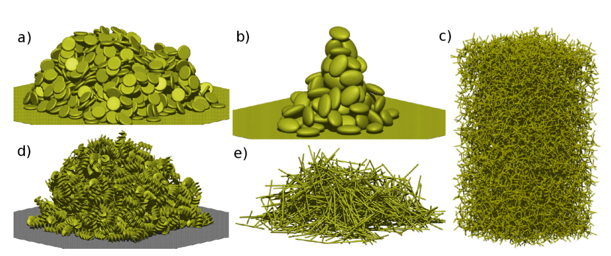

<h2 align="center">SequentiAL parTiclE Deposition</a></h2>

    <a href="https://github.com/vsangelidakis/SALTED/commits/master">
    
    <a href="https://github.com/vsangelidakis/SALTED/issues">
    
    <a href="https://github.com/vsangelidakis/SALTED/pulls">
    
    <a href="https://opensource.org/licenses/GPL-3.0">
    
    
    <a href="https://twitter.com/intent/tweet?text=SequentiAL parTiclE Deposition: &url=https%3A%2F%2Fgithub.com%2Fvsangelidakis%2FSALTED">
    

  <a href="#what-is-salted">What is SALTED</a> •
  <a href="#examples">Examples</a> •
  <a href="#share-your-own-ideas">Share your own ideas</a> •
  <a href="#acknowledging-salted">Acknowledging SALTED</a>

---

## What is SALTED?
SALTED is an efficient, open-source, event-driven algorithm for sequential ballistic deposition of complex-shaped rigid particles. Each of the particles is constructed as an agglomeration of hard spheres of variable radii, where the sizes and relative positions of the spheres may mutually overlap. In the sequential deposition process, the particles move along the steepest descent in a landscape formed by the boundaries and previously deposited particles, by performing steps of both rolling and translational motion. SALTED generalizes the Visscher–Bolsterli algorithm, which is frequently used for packing of spheres, to non-spherical particles. This code allows for the simulation of multi-million particle systems using desktop computers with reasonable time-runs, unlike typical soft-sphere algorithms, where the integration of Newton's equation of motion requires small timesteps and increased computational cost.

## Examples
SALTED can generate packings with complex particles of any shape, as demonstrated in Topic and Poeschel (2016).

<figure>
	
	<figcaption> Fig. Packing of complex particles simulated with SALTED. Case studies for a) coins, b) ellipsoids, c) tetrapods, d) spirals and e) rods.
</figcaption>
</figure>

[//]: <> (## Architectural features)

## Share your own ideas
The SALTED software package has been developed in the context of several doctoral projects at the Institute for Multiscale Simulation of the Friedrich-Alexander-Universität Erlangen-Nürnberg. Being the product of collaborative work, it is hoped that SALTED will keep being developed by its user-base, alongside the main developing team. The intention of the developers is that SALTED will be of use to researchers and practitioners alike, who venture into the simulation of particulate systems with complex particles. Expanding the code-base, proposing improvements and reporting issues are just some of the actions that can contribute towards improving this software.

## Acknowledging SALTED
Topic, N. and Pöschel, T., 2016. Steepest descent ballistic deposition of complex shaped particles. Journal of Computational Physics, 308, pp. 421-437.

[//]: <> (<h4 align="center">2022 © Vasileios Angelidakis, Nikola Topic, Thorsten Poeschel. Institute for Multiscale Simulation, FAU, Germany </a></h4>)

